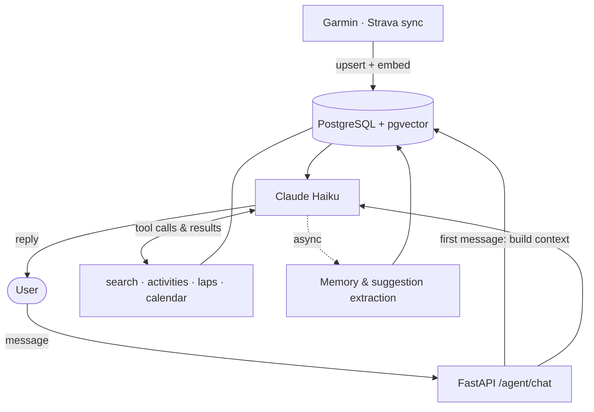
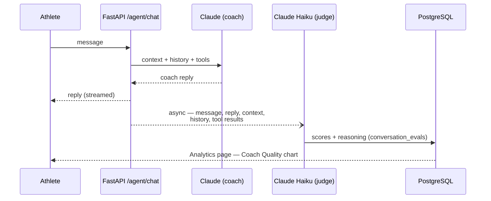
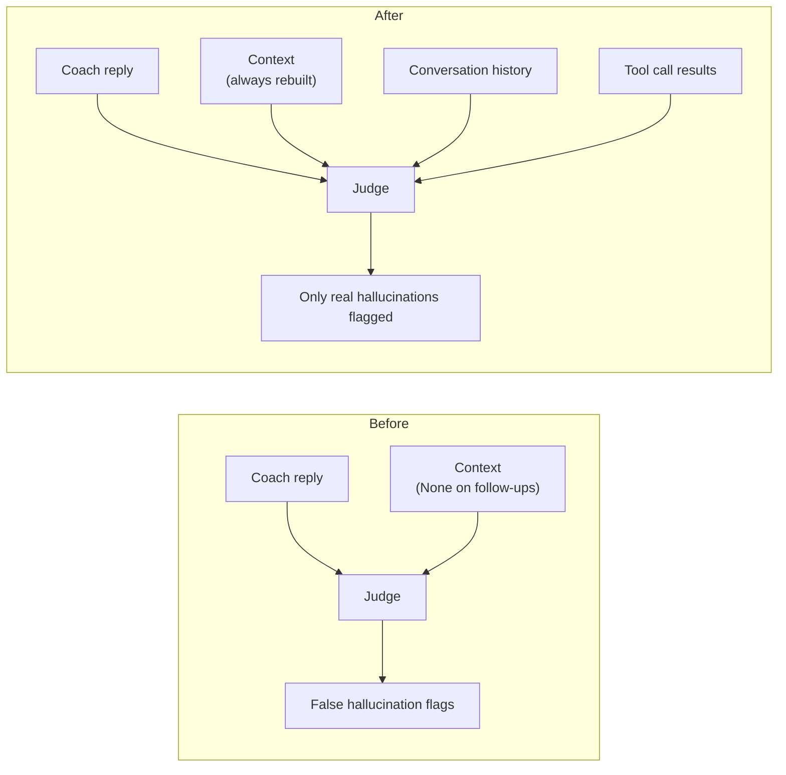

# Claudius

A personal AI training coach that aggregates your endurance data from Garmin and Strava and lets you talk to it through Claude. Built as a learning project in AI Engineering.


## What it does

- **Syncs** your Garmin activities and planned workouts from the Garmin calendar
- **Connects** to Strava via OAuth to pull additional training data
- **Coaches** you through a Claude-powered chat — direct, data-driven, no fluff
- **Calendar** shows planned workouts vs completed sessions with a Plan vs Actual comparison table
- **Remembers** your training patterns using ML embeddings (pgvector) to give context-aware responses

## Stack

| Layer     | Technology                                        |
|-----------|---------------------------------------------------|
| Frontend  | React 18 + Vite + TypeScript + Tailwind CSS       |
| Backend   | Python 3.12 + FastAPI + SQLAlchemy (async)        |
| Database  | PostgreSQL 16 with pgvector extension             |
| Cache     | Redis                                             |
| AI        | Claude (Anthropic API) — Haiku for chat, tool use |
| Sync      | Garmin Connect (garth), Strava OAuth2             |
| ML        | sentence-transformers for activity embeddings     |
| Infra     | Docker Compose                                    |

## Architecture

```
Garmin API ──┐
Strava API   ├──► FastAPI Backend ──► PostgreSQL + pgvector
             │         │
             └─────────├──► React Dashboard  (localhost:5173)
Claude API ────────────┤
                        └──► Redis (session cache)
```

## AI Coach — How it works



## Prerequisites

- Docker and Docker Compose
- A [Garmin Connect](https://connect.garmin.com) account
- A [Strava](https://www.strava.com/settings/api) API app (free)
- An [Anthropic API key](https://console.anthropic.com)

## Running the project

First-time setup:

```bash
git clone https://github.com/goncalopereira13k/Claudius
cd Claudius
cp .env.example .env
# Fill in your credentials in .env
```

### Option 1 — Everything in Docker

Builds and runs all services (Postgres, Redis, backend, frontend) in containers:

```bash
bash scripts/dev.sh
```

### Option 2 — Local dev (faster reload)

Runs only Postgres + Redis in Docker; backend and frontend run directly on your machine with hot reload. Requires a one-time local install:

```bash
cd backend && python -m venv .venv && .venv/Scripts/pip install -r requirements.txt   # Windows
cd frontend && npm install
```

Then start everything with one script:

```powershell
# Windows (opens backend and frontend in their own windows)
.\scripts\dev-local.ps1
```

```bash
# macOS / Linux (Ctrl+C stops both)
bash scripts/dev-local.sh
```

Either way, once running:

- Frontend: http://localhost:5173
- Backend API: http://localhost:8000
- API docs (Swagger): http://localhost:8000/docs

## Environment variables

Copy `.env.example` to `.env` and fill in the values:

| Variable | Description |
|---|---|
| `ANTHROPIC_API_KEY` | Anthropic API key — get it at console.anthropic.com |
| `GARMIN_EMAIL` | Your Garmin Connect email |
| `GARMIN_PASSWORD` | Your Garmin Connect password |
| `STRAVA_CLIENT_ID` | Strava app Client ID |
| `STRAVA_CLIENT_SECRET` | Strava app Client Secret |
| `STRAVA_REDIRECT_URI` | OAuth callback — default `http://localhost:8000/api/auth/strava/callback` |
| `STRAVA_DEV_ACCESS_TOKEN` | Dev-only: your personal access token from strava.com/settings/api |
| `STRAVA_DEV_REFRESH_TOKEN` | Dev-only: your refresh token from strava.com/settings/api |
| `DB_USER` | Postgres user (default: `claudius`) |
| `DB_PASSWORD` | Postgres password (default: `claudius`) |
| `DB_NAME` | Postgres database name (default: `claudius`) |

> **Note on Strava tokens**: `STRAVA_DEV_ACCESS_TOKEN` and `STRAVA_DEV_REFRESH_TOKEN` are a shortcut for single-user development. In a multi-user setup these would be persisted per-user after OAuth.

## Project structure

```
Claudius/
├── backend/
│   ├── app/
│   │   ├── agents/          # Claude agent — system prompt, tool use, chat loop
│   │   ├── api/routes/      # FastAPI endpoints (activities, sync, agent, calendar, memory)
│   │   ├── models/          # SQLAlchemy ORM models
│   │   ├── services/        # Garmin, Strava, embedding, pattern detection
│   │   └── core/            # Config, database session
│   ├── main.py
│   └── requirements.txt
├── frontend/
│   └── src/
│       ├── pages/           # Dashboard, Activities, Analytics, Calendar, Chat
│       ├── components/      # Shared layout
│       ├── services/        # Axios API client
│       └── types/           # TypeScript types
├── skill/
│   └── reference/           # Claude coach skill reference docs (periodization, zones, etc.)
├── scripts/
│   ├── setup.sh         # First-time setup (creates .env)
│   ├── dev.sh           # Full stack in Docker
│   ├── dev-local.ps1    # Local dev on Windows (DB in Docker, FE/BE local)
│   └── dev-local.sh     # Local dev on macOS/Linux
├── docker-compose.yml
└── .env.example
```

## Key API endpoints

| Method | Path | Description |
|--------|------|-------------|
| `POST` | `/api/sync/trigger` | Trigger Garmin + Strava sync |
| `GET`  | `/api/sync/calendar` | Planned workouts from Garmin calendar |
| `GET`  | `/api/activities` | Paginated activity list |
| `POST` | `/api/agent/chat` | Send a message to the Claude coach |
| `GET`  | `/api/auth/strava` | Start Strava OAuth flow |
| `GET`  | `/api/memory` | Retrieve stored training memories |

Full interactive docs at http://localhost:8000/docs when running locally.

## ML memory system

Each activity is embedded with `sentence-transformers` and stored in PostgreSQL via pgvector. When you chat with the coach, relevant past activities are retrieved by semantic similarity and injected into the Claude context. See [`backend/docs/ml_memory_system.md`](backend/docs/ml_memory_system.md) for details.

## Coach quality — LLM-as-judge evals

Every coach reply is scored in the background by a second, cheaper model (Claude Haiku) acting as an impartial judge. It never blocks the chat — evaluation runs as a fire-and-forget task after the reply is sent.



Each reply gets three scores (0–1), combined into an overall score:

| Dimension | Question it answers | Weight |
|---|---|---|
| `data_grounding` | Did the reply cite real numbers from the athlete's data? | 0.35 |
| `actionability` | Is the advice concrete and immediately executable? | 0.40 |
| `hallucination_risk` | Did the reply invent numbers/facts found in no source? | 0.25 (inverted) |

`overall = 0.35·grounding + 0.40·actionability + 0.25·(1 − hallucination)`

**Where to see it**: Analytics page → *Coach Quality · LLM Eval* chart, or `GET /api/agent/evals` for raw records including the judge's reasoning per reply.

### Judge context fix (July 2026)

Early eval scores were misleading: the training context is only built for the **first** message of a conversation (follow-ups get it from conversation history), but the judge received only that per-message context — so on follow-ups it saw *nothing* and flagged legitimate data citations as hallucinations (average hallucination risk 0.60, grounding 0.17 across the first 12 evals).

The judge now receives everything the coach actually had access to:



Concretely: `_run_evaluation` rebuilds the training context when it's `None`, the tool executor logs every tool call + result into a `tool_log` passed to the judge, and the judge prompt instructs that claims grounded in context, history, **or** tool results are not hallucinations. First eval after the fix immediately caught a real issue — the coach citing lap-by-lap detail for a session whose laps it never retrieved.

## Roadmap

- [x] Garmin activity sync
- [x] Planned workouts via Garmin calendar
- [x] Strava OAuth integration
- [x] Claude AI coach (chat + tool use)
- [x] ML memory with pgvector embeddings
- [x] Calendar — Plan vs Actual comparison
- [x] LLM-as-judge eval of coach replies (Analytics dashboard)
- [ ] Analytics page — CTL / ATL / TSB form curve
- [ ] Scheduled auto-sync (APScheduler)
- [ ] Production deployment guide

## Contributing

See [CONTRIBUTING.md](CONTRIBUTING.md).

## License

MIT — see [LICENSE](LICENSE).
